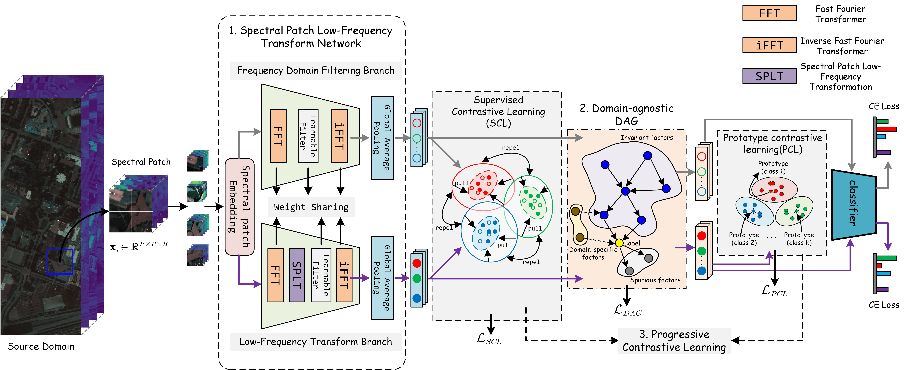

# DSPLTnet
# Harnessing Spectral Low-Frequency Stability and Causal Invariance for Cross-Scene Hyperspectral Image Classification

# Abstract
We present a new approach for cross-scene hyperspectral image (HSI) classification. Previous research has typically addressed this problem by diversifying the distribution of the source domain (SD) to enhance model generalization on unseen target domains (TD). However, these methods often neglect the adverse effects of domain-specific and spurious features, and the adversarial training process usually comes across instability and model collapse. To address these issues, we propose a novel domain-agnostic spectral patch low-frequency transformation network (DSPLTnet) for single-source domain generalization (DG) in cross-scene HSI classification. Specifically, DSPLTnet integrates frequency domain filtering branches and low-frequency transformation branches, enabling the network to focus more on domain-invariant features. Additionally, DSPLTnet constructs a domain-agnostic Directed Acyclic Graph (DAG), allowing the model to identify domain-invariant features through causal structure learning and prune domain-specific and spurious features detrimental to model generalization. To enable stable network training, a progressive contrastive learning framework is designed to obtain more representative class-conditional prototypes, facilitating the search for domain-agnostic DAGs. Extensive experiments on three cross-scene HSI classification tasks demonstrate that the proposed method significantly outperforms state-of-the-art techniques, validating the effectiveness and superiority of our method.


# Requirements：
```
1. torch==1.11.0+cu113
2. python==3.8.3
3. ptflops==0.6.9
4. timm==0.5.4
```
# Dataset:
The dataset can be downloaded from here: [HSI datasets](https://github.com/YuxiangZhang-BIT/Data-CSHSI). We greatly appreciate their outstanding contributions.

The dataset directory should look like this:
```
datasets
  Houston
  ├── Houston13.mat
  ├── Houston13_7gt.mat
  ├── Houston18.mat
  └── Houston18_7gt.mat
```

# Usage:
Houston datasets:
```
python main.py --source_name Houston13 --target_name Houston18 --patch_size 13 --training_sample_ratio 0.8
```
